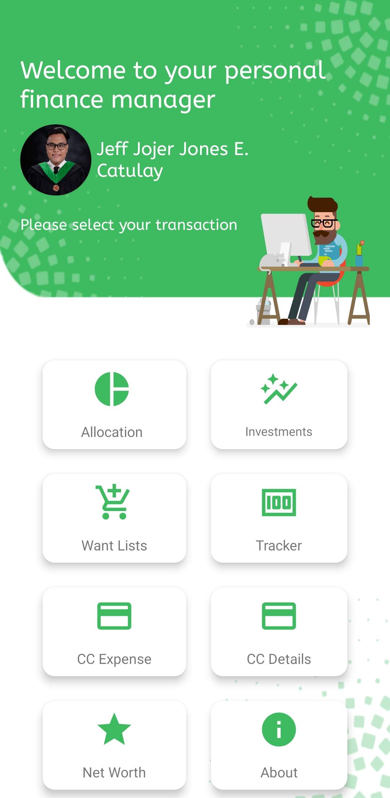

# Personal Finance Manager

## Overview

The Personal Finance Manager is designed to help users track, allocate, and manage their finances in one intuitive interface. It provides a friendly dashboard with quick access to essential financial tools.

> **Note:** This is the **previous version** of the application. A new and improved release is currently in development.

## Features

- **Allocation**: Organize your budget into categories.
- **Investments**: Track and monitor your investment portfolio.
- **Want Lists**: Keep a wishlist of future purchases.
- **Tracker**: Monitor daily expenses and income.
- **CC Expense**: Record credit card spending.
- **CC Details**: Manage credit card information securely.
- **Net Worth**: Calculate and visualize your overall financial health.
- **About**: Learn more about the app and its creators.

## Screenshot

The interface welcomes users with a personalized dashboard and transaction options:

