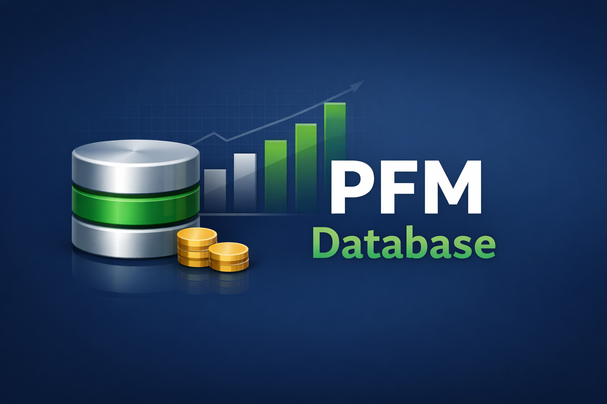
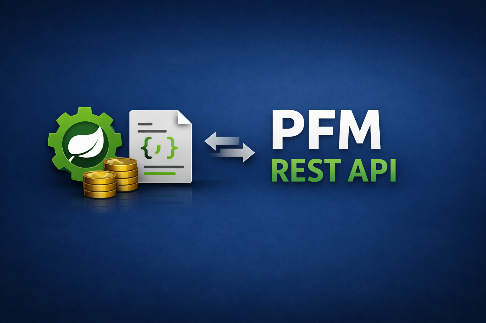

# Personal Finance Manager

The **Personal Finance Manager** is designed to help users track, allocate, and manage their finances in one intuitive interface. It provides a friendly dashboard with quick access to essential financial tools, making financial management simple and effective.

⚠️ **Note:** This project is a **work in progress**. It serves as the **central hub** for multiple related repositories that together form the complete Personal Finance Manager ecosystem.

## Features

- 📊 **Dashboard Overview**  
  Get a clear snapshot of your financial health with income, expenses, and savings displayed in one place.

- 💰 **Expense Tracking**  
  Record and categorize your daily spending to identify patterns and areas for improvement.

- 🗂️ **Budget Allocation**  
  Set budgets for different categories and monitor progress to stay on track.

- 📈 **Financial Insights**  
  Visualize trends with charts and reports to make informed decisions.

## Project Structure

This repository acts as the **main hub**. Other repositories will contain modular components such as:

- **Frontend UI** – Dashboard and visualization tools
- **Backend Services** – APIs for data storage and processing

Links to these repositories will be added as development progresses.

PFM-Database: [Repo](https://github.com/JeffJojerJonesCatulay/pfm-database.git) | [Pages](https://jeffjojerjonescatulay.github.io/pfm-database/)

PFM-Rest-API: [Repo](https://github.com/JeffJojerJonesCatulay/pfm-springboot-rest-api.git) | [Pages](https://jeffjojerjonescatulay.github.io/pfm-springboot-rest-api/)

PFM-Web: [Repo](https://github.com/JeffJojerJonesCatulay/pfm-web.git) | [Pages](https://jeffjojerjonescatulay.github.io/pfm-web/)

PFM-Test: [Repo](https://github.com/JeffJojerJonesCatulay/pfm-test.git) | [Pages](https://jeffjojerjonescatulay.github.io/pfm-test/)

PFM-Infra: [Repo](https://github.com/JeffJojerJonesCatulay/pfm-infra.git) | [Pages](https://jeffjojerjonescatulay.github.io/pfm-infra/)

---
*Note: Images used in this project were generated using Microsoft Copilot.*

